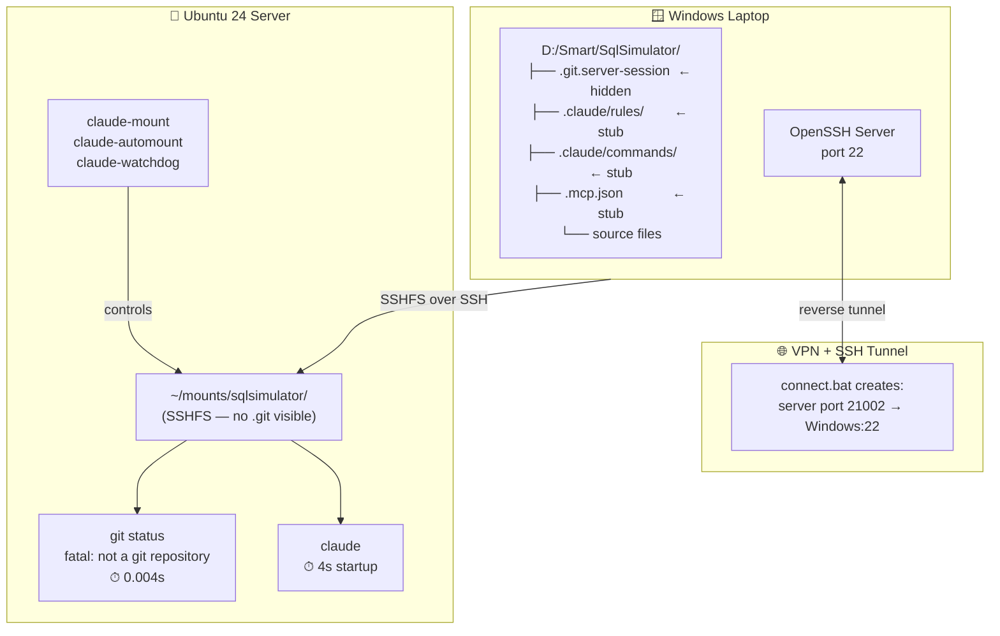
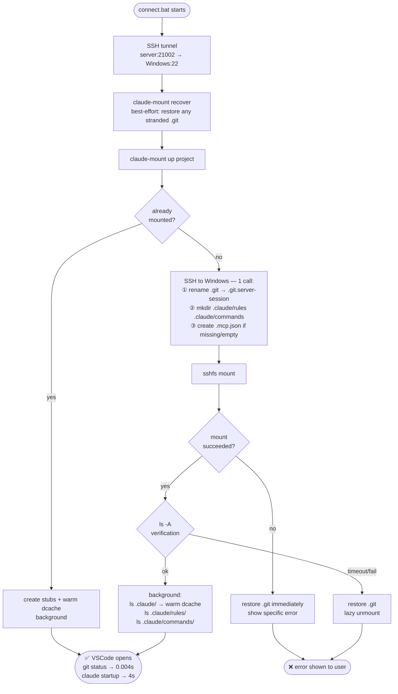
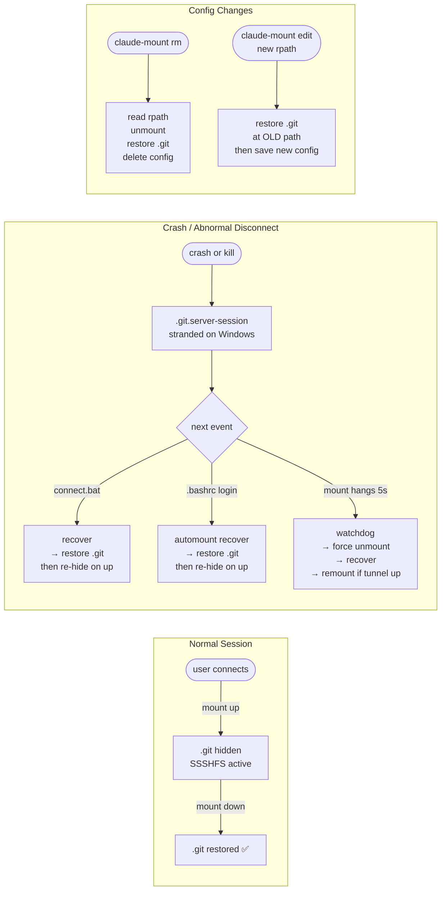
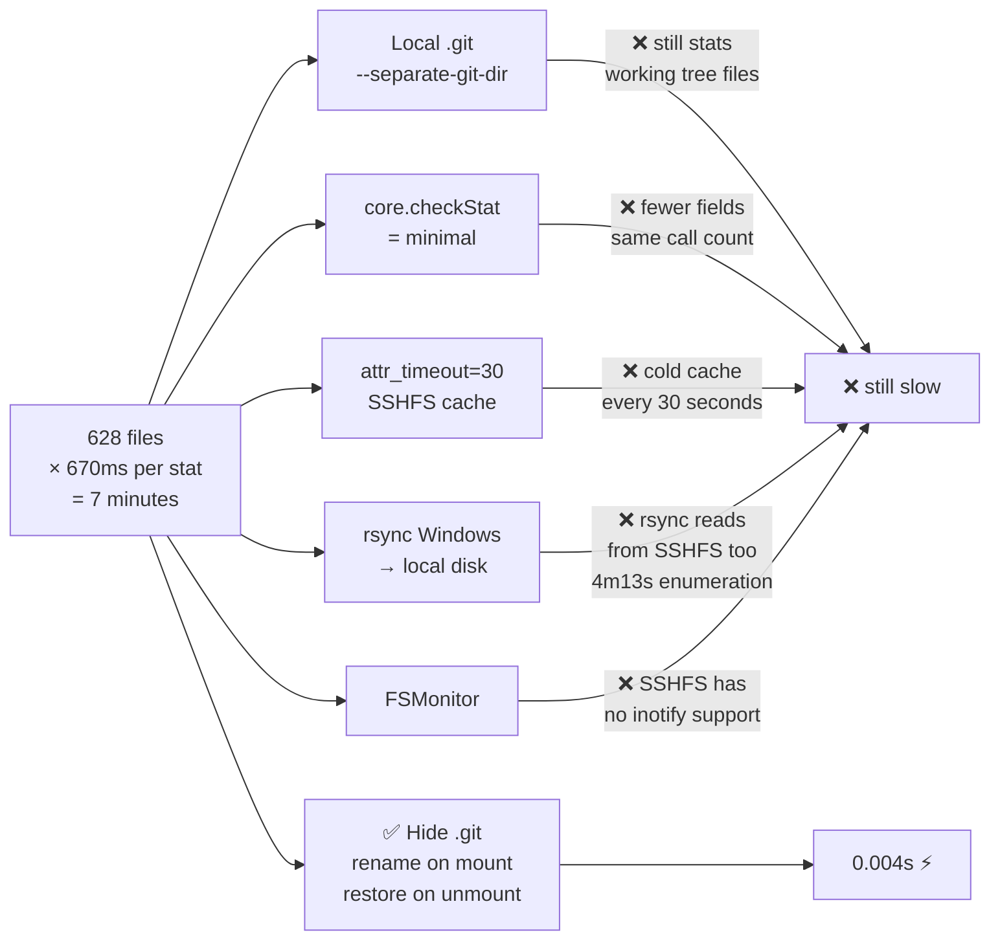
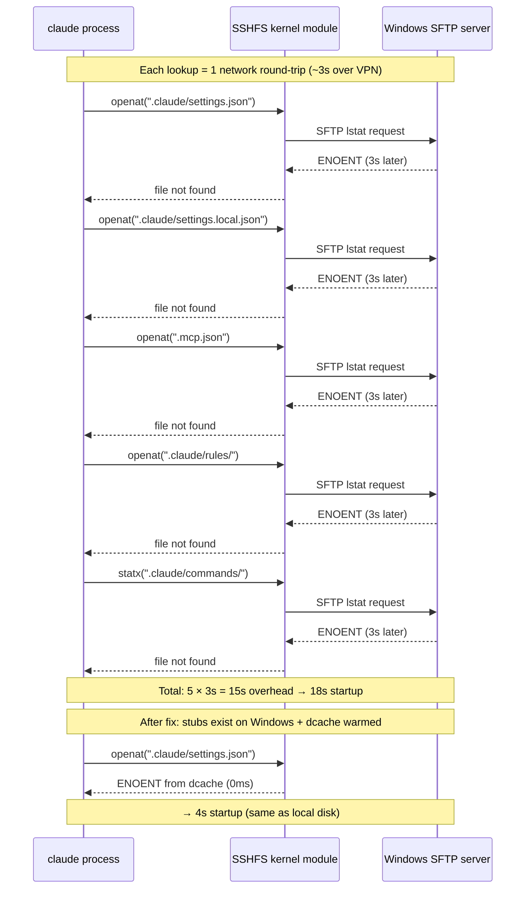

# SSHFS Performance: Full Investigation & Solution

## Context

**Setup:**
- 13 developers on Windows laptops, files live on Windows
- Ubuntu 24 server runs Claude Code (shared, multi-user)
- Connection: Windows OpenSSH ← reverse SSH tunnel ← server
- Files accessed via SSHFS over VPN through that tunnel
- Test project: SqlSimulator, 628 tracked files, C# .NET solution

**Constraint:** Files must stay on Windows (company policy). Server only accesses them via SSHFS.

---

## Diagrams

### 1. Architecture — How Everything Connects



---

### 2. Mount Flow — What Happens on connect.bat



---

### 3. Self-Healing — All Recovery Paths



---

### 4. Why Each Attempt Failed



---

### 5. Claude Startup Bottleneck (strace diagnosis)



---

## Problem 1: `git status` — 7 Minutes

### Discovery

First sign: `git status` in `~/mounts/sqlsimulator/` printed:

```
Refresh index: 100% (628/628)
```

...and never returned. After waiting, it took **7 minutes**.

### Diagnosis

```bash
time git status
# real  7m3.209s
# user  0m0.048s   ← zero CPU — pure I/O wait
# sys   0m0.024s
```

`user: 0.048s` means git did almost no computation. All time was network I/O.

**Root cause:** `git status` must `stat()` every tracked file to check modification time. Each `stat()` call goes:

```
server → SSHFS → SFTP request → SSH tunnel → VPN → Windows → SFTP response → back
```

With VPN latency, each round-trip ≈ 670ms.

```
628 files × 670ms = ~420 seconds = ~7 minutes
```

### Attempts That Failed

**Attempt 1: Local `.git` with `--separate-git-dir`**

```bash
git init --separate-git-dir ~/.git-local/sqlsimulator ~/mounts/sqlsimulator
```

Result: Still 7 minutes. The `.git` metadata moved to local disk, but `git status` still has to stat every working-tree file through SSHFS. That's where all the time goes — not reading `.git`, but checking each file.

**Attempt 2: `core.checkStat = minimal`**

Reduces what git compares per file (skips inode/uid/gid checks), only compares mtime + size. But git still needs to call `stat()` on all 628 files. Made no measurable difference.

**Attempt 3: Increase `attr_timeout` in SSHFS**

Current setting: `attr_timeout=30` (cache file attributes for 30 seconds). After 30 seconds, every `stat()` call goes back to Windows again. Increasing to 300 seconds would help for repeated runs within 5 minutes, but:
- First run in a session is still slow (cold cache)
- Developers often wait longer than 5 minutes between runs
- Doesn't solve the fundamental problem

**Attempt 4: rsync Windows → Server Local Disk**

Idea: copy files to `/tmp/test-work-sqlsimulator/` on server's local SSD, run git there.

Test:
```bash
time rsync -az --filter=':- .gitignore' --exclude='.git/' \
  ~/mounts/sqlsimulator/ /tmp/test-work-sqlsimulator/
# Interrupted after 4m13s — rsync was still building file list from SSHFS
```

Root cause of rsync slowness: rsync must enumerate the source directory (SSHFS) to know what to copy. This enumeration itself does `stat()` on every file — the same operation that makes `git status` slow. We hadn't actually gotten to the copy phase yet.

The incremental rsync (second run, no new files) was interrupted after 2.5s, but never finished, so we couldn't measure the full cost.

Local copy git status (on the partial data that rsync had already copied):
```
real  0m0.007s  ← instant on local disk
```

This confirmed the theory: **git on local disk = instant. The problem is SSHFS.**

**Attempt 5: FSMonitor**

FSMonitor lets git skip files that haven't changed since last run (no stat needed). However, FSMonitor requires a daemon running where the files are. SSHFS doesn't support inotify (kernel file-change notifications) — it's a user-space filesystem that can't propagate events from Windows. No FSMonitor support means no shortcut.

**Attempt 6: `git update-index --assume-unchanged`**

Tells git to never check specific files. Would fix speed but would also mean git never notices real changes. Not viable for development.

### The Real Solution: Hide `.git`

**Key insight:** If there is no `.git` in the working directory, git does nothing. `git status` returns `fatal: not a git repository` in milliseconds.

The challenge: `.git` must still exist on Windows for the developer's local git workflow.

**Solution:** Before mounting, SSH to Windows and rename `.git` → `.git.server-session`.

```powershell
# Runs on Windows via SSH from server
Rename-Item 'D:/Smart/SqlSimulator/.git' '.git.server-session'
```

Server mounts via SSHFS → sees no `.git` → git never runs → zero stat calls.

On unmount, rename back:
```powershell
Rename-Item 'D:/Smart/SqlSimulator/.git.server-session' '.git'
```

**Measured result:**
```bash
time git status
# fatal: not a git repository (or any of the parent directories): .git
# real  0m0.004s
```

**Before → After: 420 seconds → 0.004 seconds (105,000× faster)**

---

## Problem 2: `claude` Startup — 18 Seconds

### Discovery

After fixing `git status`, running `claude` in `~/mounts/sqlsimulator/` still hung for ~18 seconds before showing the prompt.

Comparison:
```bash
# From ~/work (local SSD):
time timeout 30 claude --print "what is 2+2"
# 4    real 0m3.774s

# From ~/mounts/sqlsimulator (SSHFS):
time timeout 30 claude --print "what is 2+2"
# 4    real 0m18.126s
```

14 seconds of unexplained overhead.

### Diagnosis with strace

```bash
strace -f -e trace=openat,stat,statx -o /tmp/trace.txt \
  timeout 20 claude --print "hi" 2>/dev/null
```

Output showed all SSHFS reads blocking:
```
645333 openat(".claude/settings.json",       O_RDONLY|O_PATH <unfinished ...>
645333 openat(".claude/settings.local.json", O_RDONLY|O_PATH <unfinished ...>
645333 openat(".mcp.json",                   O_RDONLY|O_NOCTTY <unfinished ...>
645333 openat(".claude/rules",               O_RDONLY|O_PATH <unfinished ...>
645419 statx(".claude/commands",             AT_STATX_SYNC_AS_STAT <unfinished ...>
```

`<unfinished ...>` = call is blocking, waiting for SSHFS network response.

**Root cause:** Claude Code checks for project-level config files on every startup. None of these files existed in the Windows project directory. For each non-existent file, SSHFS must do an SFTP `lstat` call to Windows to confirm it doesn't exist — even "file not found" requires a network round-trip.

```
5 missing files × ~3s per SFTP lstat = ~15s overhead
```

### Solution: Create Stubs + Pre-warm dcache

**Part 1:** Create the expected directories and files on Windows so they exist:

```powershell
New-Item -ItemType Directory -Force -Path 'D:/Smart/SqlSimulator/.claude/rules'
New-Item -ItemType Directory -Force -Path 'D:/Smart/SqlSimulator/.claude/commands'
Set-Content -Path 'D:/Smart/SqlSimulator/.mcp.json' -Value '{}'
```

SSHFS with `dcache_timeout=60` caches directory listings for 60 seconds. Once a directory exists and has been listed, all existence checks within it are answered from cache.

**Part 2:** After mounting, pre-warm the SSHFS directory cache in the background:

```bash
ls .claude/          # populate dcache for .claude/
ls .claude/rules/    # populate dcache for rules/
ls .claude/commands/ # populate dcache for commands/
```

These run in a background subshell immediately after mount. By the time the developer opens VSCode and types `claude`, the cache is warm.

**Result:**
```bash
time claude --print "hi"
# real  0m4.103s  ← same as local disk
```

**Before → After: 18s → 4s (4.5× faster)**

Note: Stubs are only created for git repositories (directories with `.git` or `.git.server-session`). Non-git utility directories (e.g. the `windows/` client scripts folder) are left untouched.

---

## Self-Healing System

The `.git` rename creates a system that must handle failures gracefully. 17 edge cases were identified and fixed:

### Failure Scenarios Covered

**Mount failures:**
- `_hide_git` succeeds, then sshfs fails → `_restore_git` called immediately before returning error
- `_hide_git` succeeds, sshfs succeeds, verification `ls` times out → `_restore_git` + lazy unmount
- Mount already active when `up` is called → stubs + cache still warmed (dcache expires between sessions)

**Session lifecycle:**
- Normal disconnect: `claude-mount down` → `_restore_git` → `.git` back on Windows
- Crash/kill signal: `.git.server-session` stays on Windows → next `connect.bat` calls `claude-mount recover` before mounting → `.git` restored then re-hidden
- Server reboot: automount calls `recover` on `.bashrc` login before `up`
- Watchdog detects hung mount → force unmount → `recover` → remount if tunnel up

**Configuration changes:**
- `claude-mount rm` → reads `rpath` from config, restores `.git`, then deletes config (if config deleted first, `rpath` is lost forever)
- `claude-mount edit` with new `rpath` → restores `.git` on old path before saving new config
- `claude-mount down` on "not mounted" project → still calls `_restore_git` (`.git.server-session` might be left from a crash)

**Data safety:**
- `cmd_recover` uses `mountpoint -q` only (not `_is_mounted`) — the `_is_mounted` check has a 2-second `ls` timeout that gives false negatives on slow SSHFS, which would restore `.git` on an active mount
- Guard `[ -n "$lpath" ]` before `mountpoint -q` — `mountpoint -q ""` exits 1, which would falsely trigger restore on malformed config
- Non-git directories: PowerShell checks `.git` existence before creating stubs — utility folders (e.g. `connect.bat` directory) stay clean

**Path edge cases:**
- Single quotes in path (`It's project`) → escaped as `''` for PowerShell single-quoted strings
- Empty `.mcp.json` → `(Get-Item ...).Length -eq 0` check ensures it gets overwritten with `{}`
- `sshfs` exit 124 with a real error message → specific error greps run first, generic "timeout" message only used as fallback

**Concurrency:**
- The rename operation is idempotent: both `_hide_git` and `_restore_git` check current state before acting, so concurrent calls are safe
- The background `_warm_sshfs_cache` subshell uses `|| true` on every `ls` to prevent `set -e` from killing the subshell on first cache miss

### Recovery Chain

Every path that could leave `.git` hidden triggers recovery:

```
connect.bat       → recover → up
automount(.bashrc)→ recover → up
watchdog          → force-unmount → recover → up (if tunnel alive)
cmd_down          → unmount → restore
cmd_rm            → unmount → restore → delete config
cmd_edit(rpath)   → restore old → update config
```

---

## Deployment

Scripts are deployed to all users via `deploy-fixes.sh`:

```bash
sudo bash ~/mounts/claude-code-server/scripts/server/deploy-fixes.sh
```

This copies `claude-mount.sh` to `/usr/local/lib/claude-mount` and then installs it to every user's `~/.local/bin/claude-mount`. The `connect.ps1` client also pushes `claude-mount.sh` directly to the connecting user's `~/.local/bin/` on every connect, keeping individual installs current without requiring admin access.

13 users on this server: `administrator`, `mohammad`, `smart`, `hamed`, `aria`, `amirhossein`, `amir`, `mehrdad`, `parsa`, `reza`, `kiana`, `hamed.kh`, `testuser2`.

---

## Final Numbers

| Operation | Before | After | Speedup |
|-----------|--------|-------|---------|
| `git status` (628 files) | 7m 3s | **0.004s** | 105,000× |
| `claude --print "hi"` (SSHFS dir) | 18.1s | **4.1s** | 4.4× |
| `claude --print "hi"` (local dir) | 3.8s | 3.8s | baseline |

CPU time during old `git status`: 0.048s — confirming it was 100% I/O bound, not compute.

---

## Architecture Overview

```
Windows laptop
├── D:/Smart/SqlSimulator/
│   ├── .git.server-session/   ← renamed on mount, restored on unmount
│   ├── .claude/rules/         ← stub created on first mount
│   ├── .claude/commands/      ← stub created on first mount
│   ├── .mcp.json              ← stub created on first mount ({})
│   └── [source files]
│
└── OpenSSH (port 22)

      SSH reverse tunnel (connect.bat)
      port 21002 on server → Windows:22

Ubuntu 24 Server
├── ~/mounts/sqlsimulator/     ← SSHFS mount
│   ├── [no .git visible]      ← hidden, git doesn't run
│   ├── .claude/ (from dcache) ← fast lookups
│   └── [source files]
│
├── /usr/local/bin/
│   ├── claude-automount       ← runs on .bashrc: recover → up → watchdog
│   └── claude-watchdog        ← background: detect hangs → recover → remount
│
└── ~/.local/bin/
    └── claude-mount           ← core: hide/restore/stubs/cache/recover
```

## Key Files

| File | Purpose |
|------|---------|
| `scripts/server/claude-mount.sh` | Core: git hide/restore, stubs, cache warm, recover, self-healing |
| `scripts/server/claude-automount.sh` | Login: recover + mount all projects + start watchdog |
| `scripts/server/claude-watchdog.sh` | Background: detect hung mounts, recover, remount |
| `scripts/client/windows/connect.ps1` | Client: tunnel + recover + mount + open VSCode |
| `scripts/server/deploy-fixes.sh` | Admin: deploy updated scripts to all 13 users |
| `docs/sshfs-performance.md` | This document |
