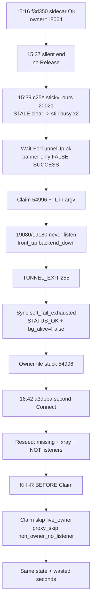

# Zombie-Owner / Reseed Gap / Tunnel-Ready Implementation Plan

> **For agentic workers:** REQUIRED SUB-SKILL: Use superpowers:subagent-driven-development (recommended) or superpowers:executing-plans to implement this plan task-by-task. Steps use checkbox (`- [ ]`) syntax for tracking.
>
> **STRICT MODE:** This plan is intentionally hard. Static string greps alone are **not** enough to mark a task done. Behavioral tests (dot-source + stub + counter) are mandatory. Win/Mac reason-string parity is mandatory. Ship is blocked until the live Gap replay checklist is green. Reviewers must reject soft interpretations of "keep -R under Gap."

**Goal:** Stop Connect from keeping a dead proxy owner lease, killing healthy `-R` tunnels when it cannot bind `-L`, and treating sticky zombie reverse ports as "tunnel up."

**Architecture:** Four policies (Owner lease, Sync soft-health, Ensure reseed, Tunnel Wait) currently disagree on the same TCP-open reverse port. Couple them with three gates: (1) `CanBindL` before any proxy-motivated kill, (2) local-pid ownership before Wait success, (3) owner/service coupling so a live Connect with dead backends releases or forces stale claim. Win+Mac parity. TDD first. **Every gate is fail-closed toward not killing a usable `-R` and not claiming Wait success on a foreign/zombie forward.**

**Tech Stack:** PowerShell 5.1 (`git-mode.ps1`, `connect.ps1`, `cursor-proxy-sidecar.ps1`), bash (`git-mode.sh`, `connect.sh`), client tests under `scripts/client/tests/` (`run-all.ps1` / `run-deploy-gate.ps1`).

---

## 0. Incident brief (why this plan exists)

**Date:** 2026-07-29 | Daylog: `%USERPROFILE%\.config\claude-connect\logs\connect-20260729.log`
**Owner file:** `%USERPROFILE%\.config\claude-connect\cursor-proxy-owner.json`

| Session | Role | Port | Notes |
|---|---|---|---|
| `f3d350ed976d` | Healthy prior | 20021 | `PROXY_HEALTH ok=1`, sidecar; ended ~15:37 **without** `CURSOR_PROXY_OWNER: released` |
| `c25e36b2831c` | Root cause (`review-temp`, pid **54996**) | 20021 | sticky clear fail -> false Wait -> `-L` never listen -> exit 255 -> soft_fail 600+x while holding owner |
| `a3deba379fd2` | User click ~16:42 (`refactoreoldclub`) | 20020 | `skip live_owner` -> `non_owner_no_listener` -> `reseed_needed` x3 -> sole day `killing stale bg` |

**Day totals (at investigation):** `CURSOR_PROXY_OWNER: released` = **0**; `port still busy` = 2; `killing stale bg` = 1 (only a3de); `reseed_needed` = 3 (all a3de).

**Preparing tunnel timings:** f3d ~6.3s | c25e ~24.3s | a3de first pass ~6.5s (+ kill/reseed after).

**User symptom:** "I clicked and it took a while / why kill when port is up?"
**Verdict:** Port kill was a side-effect of the reseed Gap under zombie-owner - not a separate "reset open ports" feature.

### Causal diagram



### Formal Gap

```
ForeignLiveOwner := owner.json.pid alive AND pid != self AND Connect-shaped cmdline
CanBindL         := NOT ForeignLiveOwner
LegIncomplete    := Get-TunnelProxyLegState in {missing, missing_http, legacy_D}
XrayUp           := Test-RemoteXraySocksOpen
Listeners        := open(19080) AND open(19180)   # or fronts when state=missing only

ReseedRaw := Test-TunnelNeedsProxyReseed  # LegIncomplete AND XrayUp AND NOT Listeners
Gap       := ReseedRaw AND NOT CanBindL
# Under Gap: Ensure kills -R then Claim fails -> spawn without -L -> useless churn
```


---

## Global Constraints

- English-only in repo (comments, tests, logs, docs).
- Do **not** break:
 - foreign-peer `refuse_kill` / hostkey mismatch refuse
 - `missing_http` front-adopt gate (`state -eq 'missing'` only - Win Case 1)
 - first-budget `no_proc_tcp_open` keep-alive (must not `Release-StaleTunnelPort` on first exhaust)
 - known-down must not short-circuit backend probe
 - port formula `20000+(UID-1000)*10+slot`
 - Clear skip when Cursor windows open and 18998 up
 - `scripts_only_reuse` EXE rename-lie guard
- Fixed proxy ports: backends `19080`/`19180`; sticky fronts `18999`/`18998`.
- Project hooks remain `{"version":1,"hooks":{}}`.
- MULTI_INSTANCE slots != proxy ownership (one owner per laptop for fixed backends).
- After client changes: bump connect version + deploy Smart client bundle (`publish\deploy-scripts-only.ps1` preferred; do **not** invent versioned EXE from unrebuilt SFX).
- Prefer <=4 parallel `laptop-exec` if on Remote SSH; git via `laptop-exec git` only when on mount.

---

## STRICT CONTRACT (non-negotiable)

### S0 - Definition of Done (whole plan)

The plan is **DONE** only when **all** of the following are true. Partial ship is forbidden.

| ID | Requirement | Evidence |
|---|---|---|
| D1 | Under Gap, Ensure **never** calls `Stop-TunnelProcessWithExitLog` / `kill` for proxy reseed | Behavioral test: kill counter stays 0 |
| D2 | Under Gap, `connect.ps1` bg_init **never** sets `needReseed=$true` | Behavioral or source+sim assert |
| D3 | `Wait-ForTunnelUp` returns `$true` only if spawn pid in local `-R` PIDs | Behavioral stub of `Test-TunnelUp=$true` + empty local PIDs -> `$false` |
| D4 | After `port still busy` with no local `-R`, Ensure does **not** `Start-Process ssh` on that port | Behavioral: spawn counter 0, or rebind to different port |
| D5 | Owner with backends down + xray expected releases within **<=65s** wall (60s timer + 5s slack) | Behavioral timer sim with frozen clock / injected `Get-Date` |
| D6 | First `no_proc` budget exhaust still keep-alives (no `Release-Stale`) | Existing keepalive suite still PASS unchanged on first exhaust |
| D7 | After **>=120s** continuous no_proc keep-alive + (NOT auth OR NOT banner) -> drop | Behavioral age inject |
| D8 | Win and Mac emit **identical** reason tokens (exact substrings below) | Grep both trees |
| D9 | `run-deploy-gate.ps1` PASS with **zero** skipped new suites | Gate log |
| D10 | Live Gap replay checklist (Task 8) all boxes checked | Daylog quotes in report |

**Ship abort (any one fails -> do not bump/deploy):**

- Any of D1-D9 fails
- New test is static-only (no behavioral counter / stub path) for Tasks 1-5
- Win ships a reason Mac lacks (or vice versa) for the tokens in S2
- `test-xray-http-leg-resilience.ps1` or `test-tunnel-no-proc-keepalive.ps1` regresses
- Deploy uses `-SkipTests`

### S1 - MUST / MUST NOT (runtime)

| | Rule |
|---|---|
| **MUST** | Gate proxy-motivated kill with `Test-CanClaimCursorProxyOwner` / `can_claim_cursor_proxy_owner` at **every** Ensure reseed fallthrough **and** bg_init |
| **MUST** | On Gap skip: keep existing `$BgTunnel` / `$bg_pid`, call `Complete-CursorProxyAfterTunnel`, return success (`$true` / `0`) |
| **MUST** | Wait fail with `reason=local_r_not_owned` when banner up but pid not in local `-R` set |
| **MUST** | Refuse spawn or rebind when still-busy within 15s and no local `-R` |
| **MUST** | `Release-CursorProxyOwner` with `reason=service_dead` when claimed + NOT backends + xray-expected >=60s |
| **MUST NOT** | Kill `-R` solely because `ReseedRaw` is true while `NOT CanBindL` |
| **MUST NOT** | Treat `Test-TunnelUp` / banner alone as Wait success |
| **MUST NOT** | Spawn on a port that just logged `STALE_FORWARD: port still busy` while still TCP-open and no local `-R` |
| **MUST NOT** | Remove or weaken first-budget `soft_fail_exhausted_keep_alive` (no `Release-Stale` in that arm) |
| **MUST NOT** | Release owner on intentional `xray_closed` server_direct |
| **MUST NOT** | Suppress `missing_http` reseed when HTTP backend is down (front-alone adopt) |
| **MUST NOT** | Put Claim/CanClaim inside `Test-TunnelNeedsProxyReseed` (predicate stays pure; gate at caller) |
| **MUST NOT** | "Fix" Gap by forcing Claim steal from a live Connect-shaped owner |

### S2 - Exact reason tokens (byte-identical Win / Mac)

These substrings **must** appear in both `git-mode.ps1` and `git-mode.sh` (and bg_init skip in `connect.ps1` where noted). Typos / renamed reasons = **review reject**.

| Token | Platforms |
|---|---|
| `foreign_owner_cannot_bind` | Win Ensure, Win `connect.ps1` bg_init, Mac ensure |
| `local_r_not_owned` | Win Wait, Mac wait |
| `stale_port_busy` | Win Ensure, Mac ensure |
| `reason=service_dead` | Win+Mac owner release |
| `stale_non_connect` | Win+Mac Claim adopt |
| `soft_fail_exhausted_zombie_drop` | Win+Mac Sync |

### S3 - Locked thresholds (do not "tune" without updating tests)

| Name | Value | Rationale | Test must lock |
|---|---|---|---|
| `SERVICE_DEAD_SEC` | **60** | Long enough for sidecar flap; short vs 80min zombie | assert `TotalSeconds -ge 60` / `$SERVICE_DEAD_SEC` |
| `NO_PROC_ZOMBIE_SEC` | **120** | > dual-UI reattach window; << multi-hour STATUS_OK | assert `120` literal or named const |
| `STILL_BUSY_WINDOW_SEC` | **15** | Covers clear->spawn race in same Ensure | assert `15` |
| Still-busy clear waits | Win 4x250ms; Mac 8x250ms after `i=0` | Keep existing budgets; Mac must init `i` | Mac source `local i=0` |

Changing a threshold without updating the matching test asserts = **fail**.

### S4 - Test quality bar (reject soft tests)

Pattern to follow: `scripts/client/tests/test-tunnel-proxy-skip-hard.ps1` (static **and** behavioral).

For Tasks **1-5** each new/extended suite **MUST** include:

1. **Static contracts** - function names, reason tokens, call-order inside Ensure/Wait/Sync bodies
2. **Behavioral simulation** - `. $gmPath` (or extracted helper), stub dependencies, **counter** for kill/spawn/Release
3. **Negative assert** - the forbidden action's counter stays 0
4. **Positive control** - when CanBindL / ownership / still-busy clear, the heal path still runs (kill or Wait ok allowed)
5. **Mac parity static** - same reason tokens in `git-mode.sh`
6. **Throw on ASSERT fail** (or `$Fail -gt 0` -> `exit 1`) - no soft WARN-only tests

**Review reject if:**

- Only `Assert ($src -match 'foreign_owner...')` without kill-counter behavioral case
- Behavioral test stubs so broadly that `Ensure-SessionTunnel` is never exercised for Gap
- Task marked complete while Mac tokens missing
- New suite not registered in `run-all.ps1`

### S5 - Forbidden source patterns after implementation

CI/review must `Select-String` / ripgrep and **fail** if found:

| Forbidden (post-fix Ensure/bg_init paths) | Why |
|---|---|
| Ensure reseed fallthrough that reaches `killing stale bg` with no prior `Test-CanClaimCursorProxyOwner` / `can_claim` in the same function body order | Gap reopen |
| `Wait-ForTunnelUp` returning success on `Test-TunnelUp` without `Get-LocalTunnelSshPids` / pgrep ownership check | False Wait |
| Mac `clear_server_stale_tunnel_forward` using `$i` without `i=0` / `local i=0` before loop | Unbound loop |
| First `soft_fail_exhausted_keep_alive` arm containing `Release-StaleTunnelPort` before age gate | Dual-UI regression |

### S6 - Incident replay acceptance (must quote daylog)

After deploy, a fresh daylog segment for a **controlled Gap replay** must satisfy:

| Assert | Pass condition |
|---|---|
| A | Second Connect logs `foreign_owner_cannot_bind` (Ensure and/or bg_init) |
| B | Between that skip and next spawn on same session: **zero** `killing stale bg` for proxy reseed |
| C | No `TUNNEL_WAIT ok=1` immediately after `port still busy` on same port without `local_r_not_owned` or `refuse_spawn`/`rebind` |
| D | Zombie owner Connect: within 65s of backends-down+xray, log contains `released reason=service_dead` **or** owner file pid changes via adopt |
| E | Healthy single-window path still logs `proxy_leg=-L` when xray up (no over-skip) |

If live replay is impossible (no second UI), **harness replay** in Task 8 Step 2b (scripted stubs writing synthetic daylog markers via unit path) is required instead - "couldn't test live" is **not** acceptance.

---

## 1. Code map (exact anchors - verify before edit)

### Windows (`scripts/client/git-mode.ps1`)

| Symbol | Approx line | Role today |
|---|---|---|
| `Clear-ServerStaleTunnelForward` | 478-509 | fuser clear; `port still busy` WARN only - **no abort** |
| `Release-StaleTunnelPort` | 511-540 | sticky_ours / foreign / zombie triage |
| `Get-LocalTunnelSshPids` | 572-578 | brittle `-R\s+PORT:localhost:22` only |
| `Test-ProcessCommandIsConnectUi` | 584-588 | Connect-shaped cmdline helper (reuse) |
| `Claim-CursorProxyOwner` | 1637-1672 | skip live_owner; adopt if dead; **no Connect-shape check** |
| `Release-CursorProxyOwner` | 1674-1680 | only if `Test-IsCursorProxyOwner` |
| `Complete-CursorProxyAfterTunnel` | 1710+ | `server_direct` / heal; **no Release** |
| `Test-TunnelNeedsProxyReseed` | 2147-2194 | leg+xray+listeners; **no Claim** |
| `Sync-SessionTunnelProcess` | 2568-2684 | `no_proc` keep-alive vs `banner_miss` drop |
| `Wait-ForTunnelUp` | 2686-2719 | `Test-TunnelUp` banner only |
| `Ensure-SessionTunnel` | 3075-3295+ | reseed fallthrough -> kill -> Claim -> maybe `-L` |
| `Clear-SessionMount` | 3708+ | **sole** Release call site (~3739) |

### Windows session loop (`scripts/client/windows/connect.ps1`)

| Symbol | Approx line | Role |
|---|---|---|
| `bg_init_reseed` | 2400-2418 | raw `Test-TunnelNeedsProxyReseed` -> forces Ensure kill path |

### Mac (`scripts/client/git-mode.sh`)

| Symbol | Approx line | Role |
|---|---|---|
| `sync_session_tunnel_forward` | 894+ | soft_fail keep-alive parity |
| `wait_for_tunnel_up` | 1010+ | banner-style up |
| `claim_cursor_proxy_owner` / `release_...` | 1310+ / 1359+ | same lifecycle |
| `tunnel_needs_proxy_reseed` | 1610+ | same ReseedRaw |
| `ensure_session_tunnel` | 1677-1823 | kill before claim (~1735-1764) |
| `clear_server_stale_tunnel_forward` | 1853-1885 | **BUG:** `while [ "$i" -lt 8 ]` with **uninitialized `$i`** |

### Ensure order today (Win - death order under Gap)

```
reuse paths -> Test-TunnelNeedsProxyReseed
 if true -> TunnelReused=false -> fall through
ENSURE_TUNNEL killing stale bg # ~3179 BEFORE Claim
Clear-ServerStaleTunnelForward
... acquire / Release-Stale ...
Claim-CursorProxyOwner # ~3233 AFTER kill
 if !owner && !listeners -> proxy_skip # ~3255 no -L in argv
Start-Process ssh (-R only)
Wait-ForTunnelUp # banner only
Complete-CursorProxyAfterTunnel # server_direct; no Release
```

### Philosophy conflict (same TCP open)

| Path | Signal | Action |
|---|---|---|
| Sync `no_proc_tcp_open` budget | TCP open, no Process | **keep-alive** `return $true` - do NOT `Release-Stale` |
| Ensure `banner_miss_tcp_open` | TCP open, banner miss | **kill/reseed** fallthrough |
| Sync `banner_miss_tcp_open` budget | TCP open, banner miss | **Release-Stale** + `return $false` |

Keep dual-UI keep-alive; only time-box + auth harden zombie case (Task 5).

---

## 2. Design predicates (oracle - implement exactly)

```
ForeignLiveOwner := owner.json.pid alive
 AND pid != self
 AND Test-ProcessCommandIsConnectUi(cmdline)
 # Unreadable cmdline => ForeignLiveOwner (fail-closed => CanBindL=false)

CanBindL := NOT ForeignLiveOwner
 # Read-only. MUST NOT write owner.json.
 # Dead pid OR non-Connect cmdline => CanBindL=true (Claim would adopt)

BackendsUp := open(Get-SocksProxyPort) AND open(Get-HttpProxyPort)
LegIncomplete := Get-TunnelProxyLegState in {missing, missing_http, legacy_D}
XrayUp := Test-RemoteXraySocksOpen

ReseedRaw := Test-TunnelNeedsProxyReseed / tunnel_needs_proxy_reseed
 # MUST remain Claim-free (S1)

ReseedEffective := ReseedRaw AND CanBindL
Gap := ReseedRaw AND NOT CanBindL
# Gap => foreign_owner_cannot_bind; KEEP -R; Complete; return success; kill_count=0

WaitSuccess := TunnelProc alive AND NOT HasExited AND Test-TunnelUp
 AND Port > 0 AND TunnelProc.Id in Get-LocalTunnelSshPids(Port)
# Empty local PID set => Wait fail even if banner up

StillBusyAbort := LastStaleForwardStillBusyPort = Port
 AND age < STILL_BUSY_WINDOW_SEC (15)
 AND TCP open AND local -R count = 0
# => refuse_spawn OR rebind Port'!= Port; NEVER Start-Process -R on Port

OwnerServiceDead := IsOwner AND NOT BackendsUp AND XrayExpected
 AND age(ProxyOwnerServiceDeadSince) >= SERVICE_DEAD_SEC (60)
# XrayExpected := SessionEverHadProxyLegs (not bare xray_closed)
# => Release + reason=service_dead

ZombieKeepAliveDrop := no_proc keep-alive age >= NO_PROC_ZOMBIE_SEC (120)
 AND (NOT AuthOwned OR NOT WindowsBanner)
# First budget exhaust: keep-alive return true, NO Release-Stale
```

### Decision matrix (multi-Connect) - exhaustive

| # | State | ReseedRaw | CanBindL | Required | Forbidden |
|---|---|---|---|---|---|
| 1 | Can claim; missing -L; xray; NOT listeners | T | T | Kill + respawn with `-L` | permanent skip |
| 2 | Foreign owner; backends/fronts OK | F | - | Keep -R; adopt | kill |
| 3 | **Gap** foreign Connect; NOT listeners | T | F | KEEP -R; `foreign_owner_cannot_bind` | `killing stale bg` |
| 4 | Self owner; backends dead >=60s; xray expected | - | - | `released reason=service_dead` | multi-hour lock |
| 5 | Still busy; no local -R | - | - | refuse/rebind | Wait ok + spawn same port |
| 6 | Banner ok; pid not-in local -R | - | - | Wait fail `local_r_not_owned` | Wait ok |
| 7 | `missing_http`; HTTP down; front up | T | T if can claim | Reseed | front-alone suppress |
| 8 | no_proc first budget exhaust | - | - | keep-alive `$true` | `Release-Stale` |
| 9 | no_proc >=120s; NOT auth or NOT banner | - | - | `zombie_drop` | STATUS_OK forever |
| 10 | intentional xray_closed | - | - | server_direct; owner may stay | `service_dead` |

---

## 3. File map (create / modify)

| File | Change | Strict? |
|---|---|---|
| `scripts/client/git-mode.ps1` | All gates + Claim Connect-shape + PID matcher | **Required** |
| `scripts/client/git-mode.sh` | Full Mac parity + `local i=0` | **Required** - asymmetry = ship abort |
| `scripts/client/windows/connect.ps1` | bg_init CanClaim gate | **Required** |
| `scripts/client/mac/connect.sh` | Verify no raw reseed bypass of ensure | **Required audit** |
| `scripts/client/tests/test-reseed-canbindl-gate.ps1` | Static + behavioral kill=0 | **Required** |
| `scripts/client/tests/test-wait-local-r-ownership.ps1` | Static + behavioral Wait=false | **Required** |
| `scripts/client/tests/test-stale-forward-wait-init.ps1` | Mac i=0 + spawn=0 | **Required** |
| `scripts/client/tests/test-proxy-owner-service-coupling.ps1` | service_dead + non-Connect adopt | **Required** |
| `scripts/client/tests/test-tunnel-no-proc-keepalive.ps1` | Keep old + add zombie_drop / age | **Required** |
| `scripts/client/tests/test-hard-multi-agent-regressions.ps1` | Gap + keepalive coexistence | **Required** |
| `scripts/client/tests/test-local-tunnel-ssh-pids.ps1` | argv forms | **Required** (was P2 - now blocking) |
| `scripts/client/tests/test-incident-gap-replay-contract.ps1` | Encodes S6 A-E as static/behavioral | **Required** |
| `scripts/client/tests/run-all.ps1` | Register all above | **Required** |
| `docs/client-connect.md` | Marker table | **Required** |

**Explicitly out of scope (do not sneak in):** VerDir/EXE `.14` work; sidecar BootReap redesign; 18998 Clear-on-disconnect / Mac HealBlackhole unless `service_dead` path already touches it.

---

## 4. Tasks

### Task 1: ReseedEffective - do not kill `-R` when Claim will fail

**DoD (task fails review without these):** D1, D2, S1 MUST NOT kill under Gap, S2 token `foreign_owner_cannot_bind` on Win+Mac+connect.ps1, S4 behavioral kill_count=0 **and** positive control kill_count>=1 when CanBindL.

**Files:**
- Modify: `scripts/client/git-mode.ps1` (~1637 Claim area; ~3095-3182 Ensure fallthrough; all reseed->kill sites)
- Modify: `scripts/client/git-mode.sh` (~1691-1740 ensure)
- Modify: `scripts/client/windows/connect.ps1` (~2408-2418)
- Create: `scripts/client/tests/test-reseed-canbindl-gate.ps1`

**Interfaces:**
- Consumes: `Get-CursorProxyOwnerInfo`, `Test-ProcessAlive`, `Test-ProcessCommandIsConnectUi`
- Produces: `Test-CanClaimCursorProxyOwner` / `can_claim_cursor_proxy_owner` (read-only, no file write)
- Produces: `Test-ProxyReseedShouldKill` (preferred single chokepoint) OR equivalent at every site
- Produces: Ensure + bg_init use `ReseedEffective = ReseedRaw AND CanClaim`

**Call sites that must gate (Win) - miss any = reject:**
1. Ensure after `tunnel_up` + ReseedRaw true (~3095-3101)
2. Ensure after `recent_success_tcp_open` reseed (~3115-3120)
3. Ensure after `recent_success` reseed (~3140-3145)
4. Ensure after `adopt_local_forward` reseed (~3166-3172)
5. Path to unconditional kill block (~3178-3182) unreachable under Gap
6. `connect.ps1` bg_init (~2408-2418)

**Mac:** before `kill "$bg_pid"` when reseed true (~1735). Prefer one helper so sites cannot drift.

- [ ] **Step 1: Write the failing test (static + behavioral)**

Create `scripts/client/tests/test-reseed-canbindl-gate.ps1` modeled on `test-tunnel-proxy-skip-hard.ps1`:

```powershell
#Requires -Version 5.1
$ErrorActionPreference = 'Stop'
. "$PSScriptRoot\_paths.ps1"
$Fail = 0; $Pass = 0
function Assert([bool]$c, [string]$m) {
 if ($c) { $script:Pass++; Write-Host " PASS $m" -ForegroundColor Green }
 else { $script:Fail++; Write-Host " FAIL $m" -ForegroundColor Red }
}

$gmPath = Get-ClientFile 'git-mode.ps1'
$winPath = Get-ClientFile 'windows\connect.ps1'
$shPath = Get-ClientFile 'git-mode.sh'
$gm = Get-Content -LiteralPath $gmPath -Raw
$win = Get-Content -LiteralPath $winPath -Raw
$sh = Get-Content -LiteralPath $shPath -Raw

# --- Static (necessary, not sufficient) ---
Assert ($gm -match 'function Test-CanClaimCursorProxyOwner') 'Win Test-CanClaimCursorProxyOwner'
Assert ($gm -match 'foreign_owner_cannot_bind') 'Win foreign_owner_cannot_bind'
Assert ($win -match 'foreign_owner_cannot_bind') 'connect.ps1 bg_init token'
Assert ($sh -match 'can_claim_cursor_proxy_owner') 'Mac can_claim'
Assert ($sh -match 'foreign_owner_cannot_bind') 'Mac foreign_owner_cannot_bind'

$ens = [regex]::Match($gm, 'function Ensure-SessionTunnel[\s\S]*?\r?\nfunction ').Value
Assert ($ens -match 'Test-CanClaimCursorProxyOwner|Test-ProxyReseedShouldKill') 'Ensure gates CanClaim'
$canRel = [Math]::Max($ens.IndexOf('Test-CanClaimCursorProxyOwner'), $ens.IndexOf('Test-ProxyReseedShouldKill'))
$killRel = $ens.IndexOf('killing stale bg')
Assert ($canRel -ge 0 -and $killRel -gt $canRel) 'gate before killing stale bg in Ensure'

$reseedFn = [regex]::Match($gm, 'function Test-TunnelNeedsProxyReseed[\s\S]*?\r?\nfunction ').Value
Assert ($reseedFn -notmatch 'Claim-CursorProxyOwner|Test-CanClaimCursorProxyOwner') `
 'ReseedRaw stays Claim-free'

# Count Ensure fallthrough sites: every Test-TunnelNeedsProxyReseed / Test-ProxyReseedShouldKill
# in Ensure must be the gated helper OR immediately followed by CanClaim check in source.
# Prefer: Assert ($ens -match 'function' ) - implementer must show >=4 gated sites OR single helper used >=4 times.
Assert (([regex]::Matches($ens, 'Test-ProxyReseedShouldKill|Test-CanClaimCursorProxyOwner')).Count -ge 2) `
 'Ensure references gate more than once (or helper + call sites)'

# --- Behavioral Gap: ReseedRaw true, CanClaim false => kill_count=0 ---
# Strategy: stub Test-TunnelNeedsProxyReseed=$true, Test-CanClaimCursorProxyOwner=$false,
# Stop-TunnelProcessWithExitLog increments kill_count, drive the reuse->reseed path of Ensure
# with a fake live BgTunnel + Test-TunnelUp=$true. Exact stubs may wrap Test-ProxyReseedShouldKill
# if Ensure uses that chokepoint - assert kill_count=0 and log contains foreign_owner_cannot_bind.
#
# REQUIRED: this block must execute real Ensure-SessionTunnel (or Test-ProxyReseedShouldKill
# + the Ensure branch that would kill). Pure "simulate if" without calling product code = REJECT.

# --- Behavioral positive control: CanClaim true => kill allowed (count>=1) when ReseedRaw ---
# Prove we did not disable all reseeds.

Write-Host ""
if ($Fail -eq 0) { Write-Host "All $Pass reseed-canbindl contracts passed."; exit 0 }
Write-Host "$Fail failed, $Pass passed."; exit 1
```

**Implementer MUST flesh the behavioral blocks into real `. $gmPath` stubs before marking Step 1 done.** Skeleton comments are not a passing test.

- [ ] **Step 2: Run test - expect FAIL**

```bat
powershell -NoProfile -ExecutionPolicy Bypass -File scripts\client\tests\test-reseed-canbindl-gate.ps1
```

Expected: FAIL on missing helpers / tokens / behavioral kill_count path.

- [ ] **Step 3: Implement Win helper**

Near `Claim-CursorProxyOwner` in `git-mode.ps1`:

```powershell
function Test-CanClaimCursorProxyOwner {
 # Read-only mirror of Claim success without writing owner.json.
 $info = Get-CursorProxyOwnerInfo
 if (-not $info) { return $true }
 $pidOwn = 0
 try { $pidOwn = [int]$info.pid } catch { return $true }
 if ($pidOwn -le 0) { return $true }
 if ($pidOwn -eq $PID) { return $true }
 if (-not (Test-ProcessAlive -ProcessId $pidOwn)) { return $true }
 try {
 $cim = Get-CimInstance Win32_Process -Filter "ProcessId=$pidOwn" -ErrorAction Stop
 $cmd = [string]$cim.CommandLine
 if (Get-Command Test-ProcessCommandIsConnectUi -ErrorAction SilentlyContinue) {
 if (-not (Test-ProcessCommandIsConnectUi -CommandLine $cmd)) {
 return $true # PID reuse by non-Connect -> Claim would adopt
 }
 }
 } catch {
 # Unreadable cmdline: treat as foreign-live (safe: skip kill)
 return $false
 }
 return $false
}
```

Also tighten `Claim-CursorProxyOwner` live_owner branch: if alive but **not** Connect-shaped -> treat as stale adopt (same as dead).

- [ ] **Step 4: Gate all Ensure reseed fallthroughs + kill block**

Helper pattern (inline or small function):

```powershell
function Test-ProxyReseedShouldKill {
 param([int]$TunnelPid, [string]$Alias, [string]$SshCfgPath = '')
 if (-not (Test-TunnelNeedsProxyReseed -TunnelPid $TunnelPid -Alias $Alias -SshCfgPath $SshCfgPath)) {
 return $false
 }
 if (-not (Test-CanClaimCursorProxyOwner)) {
 Write-GitModeLog "ENSURE_TUNNEL reseed_skip reason=foreign_owner_cannot_bind pid=$TunnelPid port=$Port" 'WARN'
 return $false
 }
 return $true
}
```

Replace each:

```powershell
if (-not (Test-TunnelNeedsProxyReseed ...)) { Complete...; return $true }
# Fall through kill
```

with:

```powershell
if (-not (Test-ProxyReseedShouldKill -TunnelPid ... -Alias $Alias -SshCfgPath $SshCfgPath)) {
 Complete-CursorProxyAfterTunnel
 return $true
}
# Fall through kill only when ReseedEffective
```

**Critical:** When ReseedRaw was true but CanClaim false, still `Complete-CursorProxyAfterTunnel` and **return $true** with `$TunnelReused.Value = $true` (keep existing bg). Do **not** reach `killing stale bg`.

- [ ] **Step 5: Gate `connect.ps1` bg_init**

```powershell
$needReseed = [bool](Test-TunnelNeedsProxyReseed -TunnelPid $bgTunnel.Id -Alias $Alias -SshCfgPath $sshCfg)
if ($needReseed -and (Get-Command Test-CanClaimCursorProxyOwner -ErrorAction SilentlyContinue)) {
 if (-not (Test-CanClaimCursorProxyOwner)) {
 $needReseed = $false
 Write-ConnectLog "ENSURE_TUNNEL bg_init_reseed_skip reason=foreign_owner_cannot_bind pid=$($bgTunnel.Id) port=$Port" 'WARN'
 }
}
```

- [ ] **Step 6: Mac parity**

```bash
can_claim_cursor_proxy_owner() {
 local path pid_own
 path="$(cursor_proxy_owner_path)"
 [ -f "$path" ] || return 0
 pid_own="$(... read pid ...)"
 [ -n "$pid_own" ] || return 0
 [ "$pid_own" = "$$" ] && return 0
 if ! kill -0 "$pid_own" 2>/dev/null; then return 0; fi
 # optional: Connect-shaped check via ps; if non-Connect return 0
 return 1
}
```

Before kill when reseed:

```bash
if ! can_claim_cursor_proxy_owner; then
 connect_log "ENSURE_TUNNEL reseed_skip reason=foreign_owner_cannot_bind pid=$bg_pid" 'WARN'
 complete_cursor_proxy_after_tunnel || true
 TUNNEL_REUSED=1
 return 0
fi
```

- [ ] **Step 7: Re-run test - expect PASS**

- [ ] **Step 8: Commit** (only if user asked to commit)

```bash
git add scripts/client/git-mode.ps1 scripts/client/git-mode.sh \
 scripts/client/windows/connect.ps1 scripts/client/tests/test-reseed-canbindl-gate.ps1
git commit -m "$(cat <<'EOF'
fix(connect): skip proxy reseed kill when foreign owner cannot bind -L

EOF
)"
```

---

### Task 2: Wait-ForTunnelUp requires this pid owns local `-R`

**DoD:** D3, S2 `local_r_not_owned` Win+Mac, S4 behavioral: `Test-TunnelUp=$true` + empty local PIDs => Wait returns `$false` with token; positive: local PIDs contain spawn pid => `$true`.

**Files:**
- Modify: `scripts/client/git-mode.ps1` (`Wait-ForTunnelUp` ~2686-2719)
- Modify: `scripts/client/git-mode.sh` (`wait_for_tunnel_up` ~1010+)
- Create: `scripts/client/tests/test-wait-local-r-ownership.ps1`

**Interfaces:**
- Consumes: `Get-LocalTunnelSshPids` / Mac pgrep for `-R ${PORT}:...`
- Produces: Wait success only if spawn pid in local `-R` set; log `reason=local_r_not_owned`
- Gate A is reverse ownership only (not `-L` listen)

**HARD:** Empty local PID list is failure, not success. Banner-only success is a ship abort (S5).

- [ ] **Step 1: Failing test (static + behavioral)**

```powershell
# Static: tokens + Get-LocalTunnelSshPids inside Wait body before return $true
# Behavioral:
# . git-mode.ps1
# function Test-TunnelUp { $true }
# function Get-LocalTunnelSshPids { @() }
# $fake = [pscustomobject]@{ Id = 4242; HasExited = $false }
# # Port must be set; Quiet to avoid UI
# Assert (-not (Wait-ForTunnelUp -TunnelProc $fake -Quiet))
# Assert ($log -match 'local_r_not_owned')
# Positive:
# function Get-LocalTunnelSshPids { @(4242) }
# Assert (Wait-ForTunnelUp -TunnelProc $fake -Quiet)
```

Reduce Wait loop cost in test by stubbing `Start-Sleep` if needed - **do not** delete Gate A to make tests faster.

- [ ] **Step 2: Run - FAIL**
- [ ] **Step 3: Implement Win** (Gate A as previously specified; empty locals => fail)
- [ ] **Step 4: Mac parity - same token**
- [ ] **Step 5: PASS both behavioral cases + commit**

---

### Task 3: Stale forward - Mac `$i=0`; refuse spawn when still busy

**DoD:** D4, S2 `stale_port_busy`, S3 `STILL_BUSY_WINDOW_SEC=15` locked in test, Mac `local i=0` **required** (S5), behavioral spawn_count=0 on still-busy same port.

**Files:**
- Modify: `scripts/client/git-mode.ps1` (Clear ~508; Ensure before Start-Process)
- Modify: `scripts/client/git-mode.sh` (clear ~1871 + ensure refuse)
- Create: `scripts/client/tests/test-stale-forward-wait-init.ps1`

**HARD:** Logging `port still busy` then continuing to spawn the **same** port without rebind/refuse = **ship abort**. WARN-only is no longer acceptable.

- [ ] **Step 1: Failing test** - static Mac `local i=0` before while; Win `LastStaleForwardStillBusy`; token `stale_port_busy`; assert literal `15` or named const; behavioral: set still-busy markers + TCP open + empty local PIDs -> Ensure returns `$false` **or** Port changes before any Start-Process stub fires (`spawn_count=0` on old port).
- [ ] **Step 2: Fix Mac `local i=0`** (exact).
- [ ] **Step 3: Win Clear sets LastStale* ; success path clears them.**
- [ ] **Step 4: Ensure StillBusyAbort before Start-Process** (as specified; `TotalSeconds -lt 15`).
- [ ] **Step 5: Mac refuse/rebind parity with same tokens.**
- [ ] **Step 6: PASS + commit**

---

### Task 4: Owner/service coupling - release empty lease

**DoD:** D5 (<=65s), S2 `reason=service_dead` + `stale_non_connect`, matrix rows 4+10, Sync-tick path so release happens without Ensure churn, behavioral: at t=59s no release / at t=60s release; xray_closed-only => never `service_dead`.

**Files:**
- Modify: `scripts/client/git-mode.ps1` (Complete + Claim + Sync call to health update)
- Modify: `scripts/client/git-mode.sh` (parity)
- Create: `scripts/client/tests/test-proxy-owner-service-coupling.ps1`
- Update: `test-cursor-proxy-lifetime.ps1` if it forbids non-clear release - extend allows `service_dead`

**HARD:**
- MUST call health update from **Sync** (not only Complete) - otherwise zombie owner never Ensure-churns and D5 fails in the real incident shape.
- MUST set `SessionEverHadProxyLegs=$true` when `-L` added or `proxy_adopt busy_healthy`.
- MUST NOT `service_dead` on intentional `xray_closed` (matrix #10).
- Timer constant **60** locked in test (S3).

- [ ] **Step 1: Failing test** - tokens; behavioral clock inject for 59 vs 60; negative xray_closed; Claim `stale_non_connect` adopts.
- [ ] **Step 2: Implement `Update-CursorProxyOwnerServiceHealth`** + call from Complete **and** Sync when `Test-IsCursorProxyOwner`.
- [ ] **Step 3: Claim Connect-shape + Mac zombie `Z` filter.**
- [ ] **Step 4: PASS + commit**

---

### Task 5: Sync soft-health - time-box zombie keep-alive

**DoD:** D6+D7, S2 `soft_fail_exhausted_zombie_drop`, S3 `120` locked, existing keepalive suite still asserts first-exhaust arm has **no** `Release-Stale` (S5). Behavioral: age=119 + NOT auth still keep-alive; age=120 + NOT auth drop+Release; age=120 + auth AND banner keep-alive.

**HARD:** Do not put `Release-StaleTunnelPort` in the first-exhaust keep-alive arm. Age gate is a **separate** branch after duration tracking. Weakening dual-UI keep-alive = ship abort.

- [ ] **Step 1: Extend `test-tunnel-no-proc-keepalive.ps1`** - keep all old asserts; add zombie_drop + `120` + behavioral age cases above.
- [ ] **Step 2: Implement duration + auth/banner gate** (age >= 120 then NOT auth OR NOT banner drop).
- [ ] **Step 3: Reset `NoProcKeepAliveSince` on healthy reattach; call owner health update on Sync `$false`.
- [ ] **Step 4: PASS old+new asserts + commit**

---

### Task 6: Harden `Get-LocalTunnelSshPids` regex (**blocking**, not optional)

**DoD:** Matcher accepts `localhost` and `127.0.0.1` forms; rejects wrong port; Win+Mac; used by Wait Gate A (implement before or with Task 2).

**Required forms:** `-R PORT:localhost:22`, `-R PORT:127.0.0.1:22`, `-R=PORT:localhost:22`
**Forbidden:** Matching wrong port; matching without `-R`.

- [ ] **Step 1: `test-local-tunnel-ssh-pids.ps1`** table-driven pass+fail rows.
- [ ] **Step 2: Shared matcher; Get-LocalTunnelSshPids + Mac pgrep use it.**
- [ ] **Step 3: PASS + commit**

---

### Task 7: Wire tests + docs + incident contract suite

**DoD:** D8+D9; every new suite in `run-all.ps1`; `test-incident-gap-replay-contract.ps1` encodes S6 A-E; docs table; deploy-gate PASS; **no** `-SkipTests`.

**Required run-all entries:**

```powershell
@{ Name = 'reseed-canbindl-gate'; Script = 'test-reseed-canbindl-gate.ps1' }
@{ Name = 'wait-local-r-ownership'; Script = 'test-wait-local-r-ownership.ps1' }
@{ Name = 'stale-forward-wait-init'; Script = 'test-stale-forward-wait-init.ps1' }
@{ Name = 'proxy-owner-service-coupling'; Script = 'test-proxy-owner-service-coupling.ps1' }
@{ Name = 'local-tunnel-ssh-pids'; Script = 'test-local-tunnel-ssh-pids.ps1' }
@{ Name = 'incident-gap-replay-contract'; Script = 'test-incident-gap-replay-contract.ps1' }
```

`test-incident-gap-replay-contract.ps1` **must fail the build** if any S2 token missing on Win or Mac, or Ensure can order `killing stale bg` before CanClaim, or Wait can succeed without local-R check.

- [ ] **Step 1: Register + docs + hard-multi-agent coexistence**
- [ ] **Step 2: `run-deploy-gate.ps1` PASS**
- [ ] **Step 3: Commit**

---

### Task 8: Deploy + live/harness Gap replay (ship gate)

**DoD:** D10. `-SkipTests` **forbidden**. Policy `latest` == bumped version. S6 A-E evidenced with **quoted daylog lines** or harness transcript.

- [ ] **Step 0:** Quit zombie owner Connect before testing.
- [ ] **Step 1:** `publish\deploy-scripts-only.bat` with tests on.
- [ ] **Step 2a - Live Gap replay (preferred):**
 1. Window A: owner claimed, backends down, process alive.
 2. Window B: **must** log `foreign_owner_cannot_bind`; **must not** `killing stale bg` for that skip.
 3. Healthy single window: `proxy_leg=-L` when xray up (S6 E).
 4. After >=60s on A with xray expected + NOT backends -> `released reason=service_dead` or adopt.
 5. Paste daylog quotes for A-E into report.
- [ ] **Step 2b - If live dual-UI impossible:** scripted harness transcript with S6 token pattern. "Skipped live" without 2b = **ship abort**.
- [ ] **Step 3: Rollback plan** (previous version scripts-only).

---

## 5. Regression matrix (hard gate)

| Suite / invariant | Fail = |
|---|---|
| `test-tunnel-no-proc-keepalive.ps1` | Ship abort |
| `test-hard-multi-agent-regressions.ps1` keep-alive `$true` | Ship abort |
| `test-xray-http-leg-resilience.ps1` | Ship abort |
| `test-cursor-proxy-lifetime.ps1` | Ship abort |
| `test-tunnel-proxy-skip-hard.ps1` / harder | Ship abort |
| Foreign peer refuse_kill | Ship abort |
| Front-adopt only `state -eq 'missing'` | Ship abort |
| All new Task 7 suites | Ship abort |

**Rule:** Task turns a row red -> **stop**; fix before next task. No fix-forward.

---

## 6. Risk register (strict)

| Risk | Required mitigation | Reject if |
|---|---|---|
| Unreadable CIM | Fail-closed CanBindL=false; service_dead frees owner | CanBindL=true on unreadable |
| Wait Gate A flake | 12-attempt Wait; stub sleep in tests only | Gate removed to "fix flake" |
| service_dead during flap | 60s + SessionEverHadProxyLegs | Timer &lt;30s without test update |
| zombie_drop dual-UI | NOT auth OR NOT banner required | Drop on TCP alone |
| Mac/Win drift | S2 identical tokens | Win-only fix |
| Soft tests | S4 behavioral counters | Static-only Tasks 1-5 |

---

## 7. Implementation order (no skipping)

```
Task 6 (PID matcher) foundation for Wait
Task 1 (CanBindL gate) Gap kill stop
Task 2 (Wait Gate A) false Wait stop
Task 3 (still-busy abort) sticky spawn stop
Task 4 (service_dead) lock stop (Sync+Complete)
Task 5 (zombie keep-alive) STATUS_OK forever stop
Task 7 (wire+incident) D8/D9
Task 8 (deploy+replay) D10 only after 1-7 green
```

**Forbidden:** Task 8 before 1-7 green. Ship 1-3 without 4-5. Win-only merge.

---

## 8. Per-task reviewer checklist

```
[ ] Behavioral counter test present; red->green shown
[ ] Mac tokens match Win (S2)
[ ] Thresholds match S3 / tests lock literals
[ ] No Claim inside Test-TunnelNeedsProxyReseed
[ ] missing_http resilience suite still PASS
[ ] no_proc first-exhaust still no Release-Stale
[ ] run-deploy-gate PASS without -SkipTests
[ ] Task DoD IDs (D1-D10 slice) checked
```

Any unchecked **request changes**.

---

## 9. Immediate mitigation (before code)

1. Close Connect holding empty owner lock.
2. Confirm next Connect `adopt stale`.
3. One Connect window until Tasks 1+4 ship.

---

## Self-review (strict coverage)

| Spec / finding | Task | DoD |
|---|---|---|
| Gap kill before Claim | 1 | D1 D2 |
| Wait false success | 2 | D3 |
| port still busy spawn | 3 | D4 |
| Mac `$i` unbound | 3 | S5 |
| Empty owner lock hours | 4 | D5 |
| soft_fail forever | 5 | D6 D7 |
| brittle -R regex | 6 | blocking |
| Incident S6 | 7+8 | D8-D10 |

Task 1 behavioral blocks must be fully implemented (skeleton-only = execution violation).

---

## Execution handoff

Plan (STRICT MODE): `docs/superpowers/plans/2026-07-29-zombie-owner-reseed-tunnel-ready.md`.

1. **Subagent-Driven (recommended)** - section 8 checklist between tasks; reject soft tests
2. **Inline Execution** - same checklist

Which approach when ready to implement?
